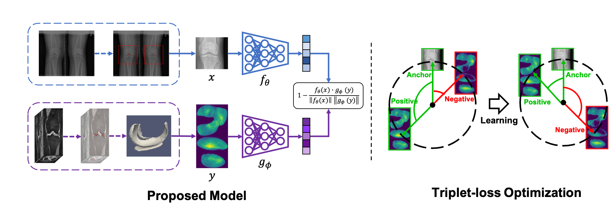
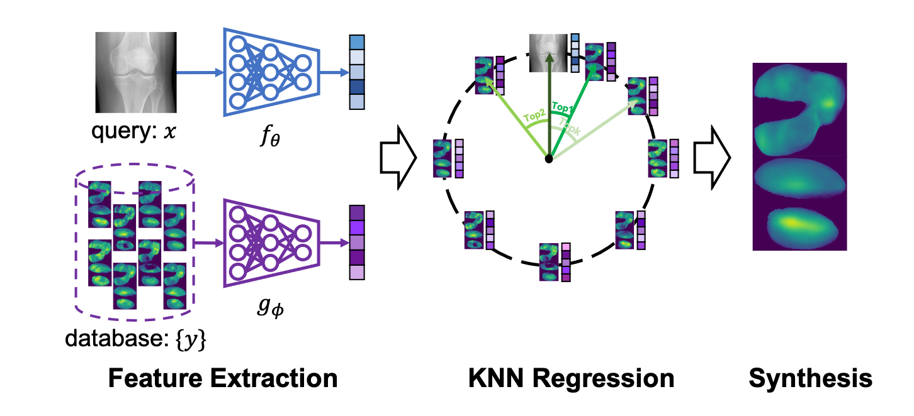
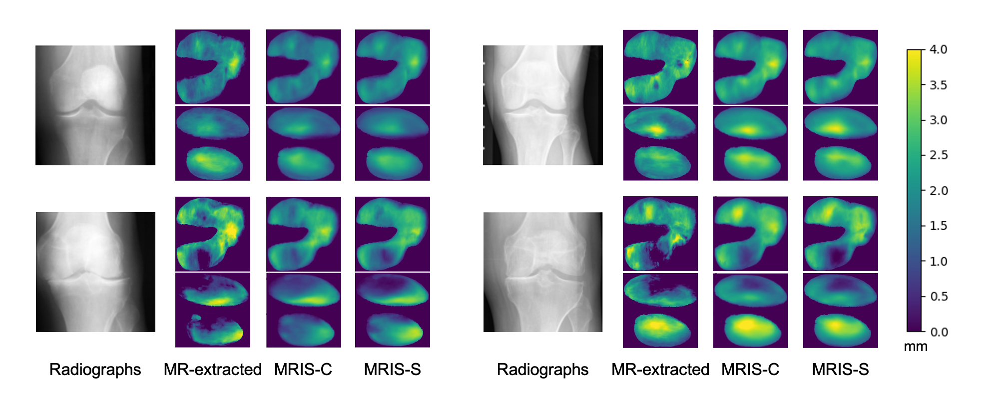

# MRIS: A Multi-modal Retrieval Approach for Image Synthesis on Diverse Modalities 

This repo includes the code for [MRIS: A Multi-modal Retrieval Approach for Image 
Synthesis on Diverse Modalities](https://arxiv.org/pdf/2303.10249.pdf). 

We show our method on the [OAI dataset](https://nda.nih.gov/oai/) by synthesizing 
cartilage thickness maps obtained from 3D magnetic resonance images using 2D radiographs.


### Installation
```
git clone https://github.com/uncbiag/MRIS.git
cd MRIS
conda env create -f environment.yml
conda activate mris
```

### Pipeline

1. Metric Learning

   ```
   python train.py --save_name <save folder> --region <fc/tc/all> --augmentation --one_per_patient
   ```  
    
2. Image retrieval
   ```
   python evaluation.py --ckp_path <checkpoint path> --region <fc/tc/all> --one_per_patient
   ```  
   
3. Image synthesis and result analysis

   ```
   python synthesis.py --ckp_path <checkpoint path> --region <fc/tc/all>
   ```

### Results


### Citation
If you find this project useful, please cite:

```
@article{chen2023mris,
  title={MRIS: A Multi-modal Retrieval Approach for Image Synthesis on Diverse Modalities},
  author={Chen, Boqi and Niethammer, Marc},
  journal={arXiv preprint arXiv:2303.10249},
  year={2023}
}
```


